jskm
================

Kaplan-Meier Plot with ‘ggplot2’: ‘survfit’ and ‘svykm’ objects from
‘survival’ and ‘survey’ packages.

[](https://ci.appveyor.com/project/jinseob2kim/jskm)
[](https://github.com/jinseob2kim/jskm/actions)
[](https://cran.r-project.org/package=jskm)
[](https://CRAN.R-project.org/package=jskm)
[](https://app.codecov.io/github/jinseob2kim/jskm)
[](https://github.com/jinseob2kim/jskm/issues)
[](https://github.com/jinseob2kim/jskm/stargazers)
[](https://github.com/jinseob2kim/jskm/blob/master/LICENSE)

## Install

``` r
install.packages("jskm")

## From github: latest version
install.packages("remotes")
remotes::install_github("jinseob2kim/jskm")

library(jskm)
```

## Example

### Survival probability

``` r
#Load dataset
library(survival)
data(colon)
fit <- survfit(Surv(time,status)~rx, data=colon)

#Plot the data
jskm(fit)
```

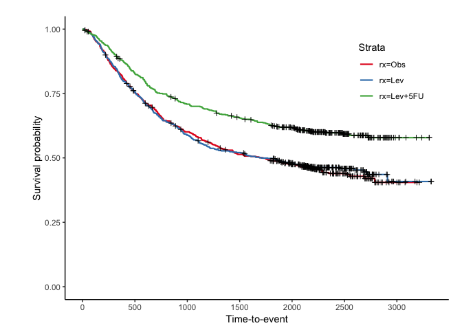<!-- -->

``` r
jskm(fit, table = T, pval = T, label.nrisk = "No. at risk", size.label.nrisk = 8, 
     xlabs = "Time(Day)", ylabs = "Survival", ystratalabs = c("Obs", "Lev", "Lev + 5FU"), ystrataname = "rx",
     marks = F, timeby = 365, xlims = c(0, 3000), ylims = c(0.25, 1), showpercent = T)
```

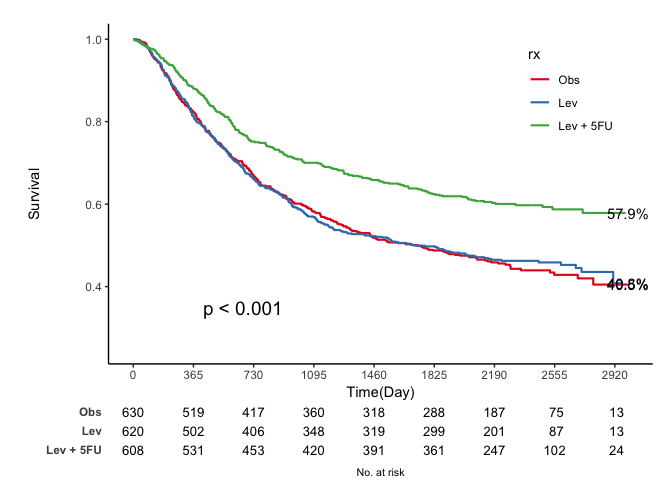<!-- -->

### Cumulative hazard: 1- Survival probability

``` r
jskm(fit, ci = T, cumhaz = T,  mark = F, ylab = "Cumulative incidence (%)", surv.scale = "percent", pval =T, pval.size = 6, pval.coord = c(300, 0.7))
```

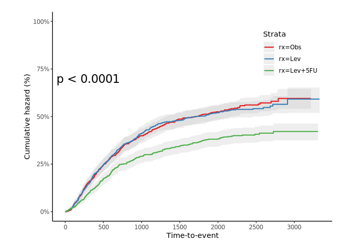<!-- -->

### Landmark analysis

``` r
jskm(fit, mark = F,  surv.scale = "percent", pval =T, table = T, cut.landmark = 500)
```

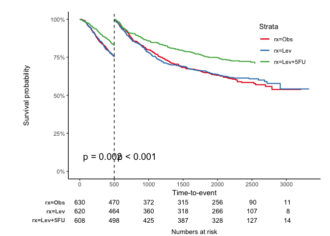<!-- -->

``` r
jskm(fit, mark = F,  surv.scale = "percent", pval =T, table = T, cut.landmark = 500, showpercent = T)
```

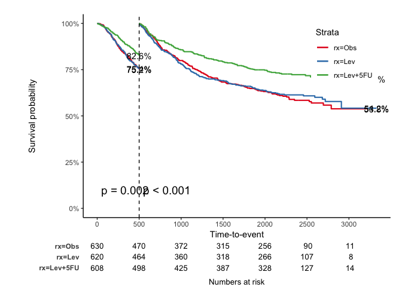<!-- -->

### Competing risk analysis

`status2` variable: 0 - censoring, 1 - event, 2 - competing risk

``` r
## Make competing risk variable, Not real
colon$status2 <- colon$status
colon$status2[1:400] <- 2
colon$status2 <- factor(colon$status2)
fit2 <- survfit(Surv(time,status2)~rx, data=colon)
jskm(fit2, mark = F, surv.scale = "percent", table = T, status.cmprsk = "1")
```

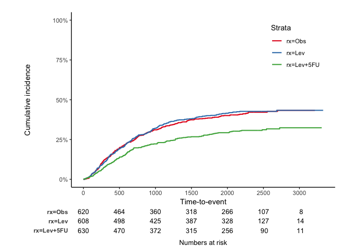<!-- -->

``` r
jskm(fit2, mark = F, surv.scale = "percent", table = T, status.cmprsk = "1", showpercent = T, cut.landmark = 500)
```

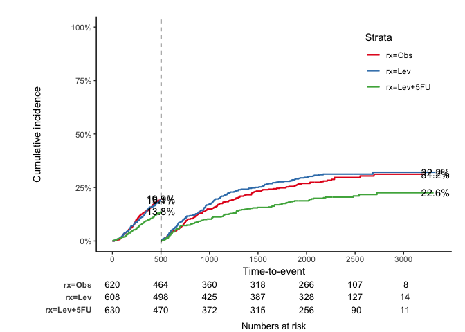<!-- -->

### Weighted Kaplan-Meier plot - `svykm.object` in **survey** package

``` r
library(survey)
data(pbc, package="survival")
pbc$randomized <- with(pbc, !is.na(trt) & trt>0)
biasmodel <- glm(randomized~age*edema,data=pbc)
pbc$randprob <- fitted(biasmodel)

dpbc<-svydesign(id=~1, prob=~randprob, strata=~edema, data=subset(pbc,randomized))

s1 <-svykm(Surv(time,status>0) ~ 1, design = dpbc)
s2 <-svykm(Surv(time,status>0) ~ sex, design = dpbc)

svyjskm(s1)
```

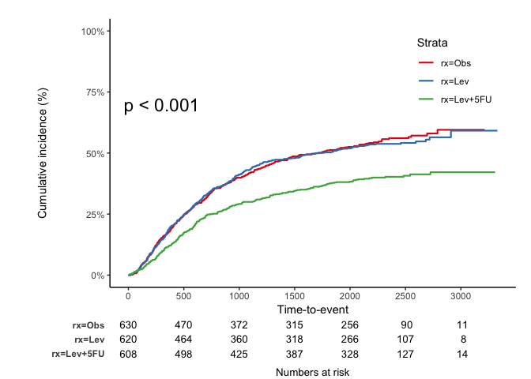<!-- -->

``` r
svyjskm(s2, pval = T,  table = T, design = dpbc)
```

<!-- -->

``` r
svyjskm(s2, cumhaz = T, ylab = "Cumulative incidence (%)", surv.scale = "percent", pval = T, design = dpbc, pval.coord = c(300, 0.7), showpercent = T) 
```

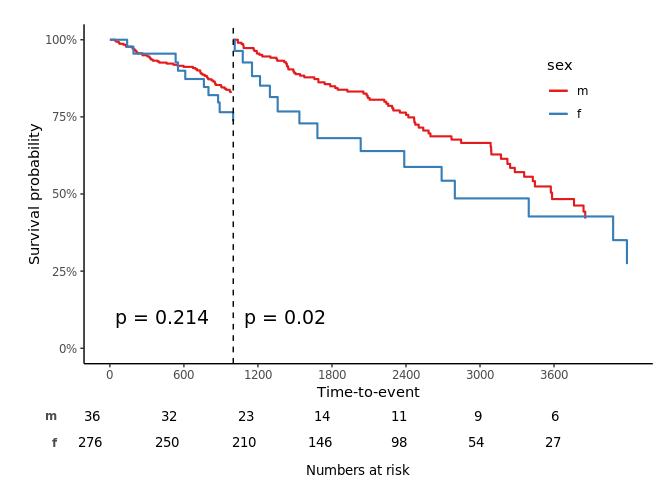<!-- -->

If you want to get **confidence interval**, you should apply `se = T`
option to `svykm` object.

``` r
s3 <- svykm(Surv(time,status>0) ~ sex, design=dpbc, se = T)
svyjskm(s3)
```

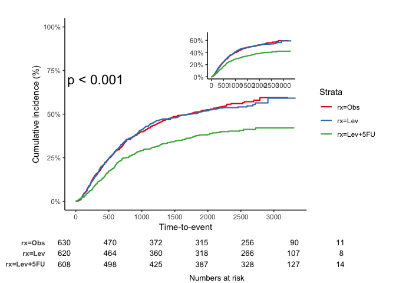<!-- -->

``` r
svyjskm(s3, ci = F)
```

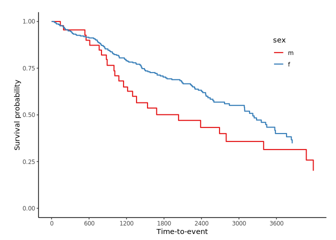<!-- -->

``` r
svyjskm(s3, ci = F,  surv.scale = "percent", pval =T, table = T, cut.landmark = 1000, showpercent = T)
```

<!-- -->
